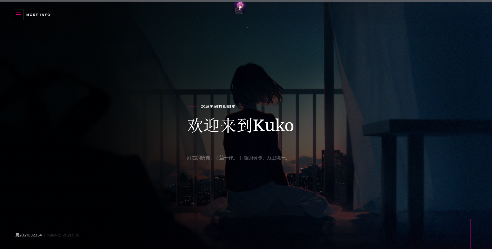

# [kuko](https://www.kuko.icu/Mili_Wallpaper)


___



使用 **flask** 框架制作

## 功能

- index http://127.0.0.1/

    主页 (/templates/index.html) 静态资源 (/static/index/*)

- 10_12

  None

- Mili_Wallpaper http://127.0.0.1/Mili_Wallpaper

  Mili_Wallpaper 官网 [Github-Mili_Wallpaper](https://github.com/PYmili/Mili_Wallpaper)

  (/templates/Mili_Wallpaper.html) 静态资源(/static/Mili_Wallpaer)

- RziL http://127.0.0.1/RziL

  音乐搜索网页 (/templates/RziL.html) 静态资源(/static/RziL)

- API

  - rembg http://127.0.0.1/rembg
    
    静态资源 (/static/rembg)
    
    ```
    使用Python第三方库深度学习库rembg实现图片人物扣取
    http://127.0.0.1/rembg?file=一个图片的网页链接
    ```
  
  - share http://127.0.0.1/API/share
  
    ```
    共享 /static/share下所有文件
    http://127.0.0.1/API/share?filename=文件名
    ```
  
  - PixivImage http://127.0.0.1/API/PixivImage
    
    随机返回一个P站图片

## 使用

```
pip install -r requirements.txt
```

```
python app.py
```

建议使用nginx反向代理域名